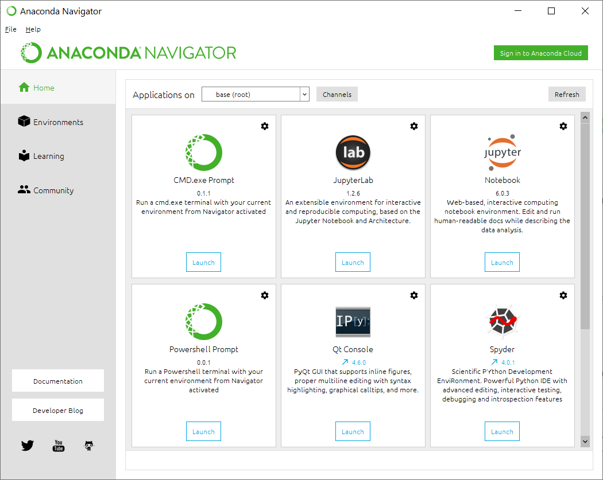

# Introduction
This repository contains the course materials for hands-on exercise session of the "Variants Annotate and Phenotype Analysis" workshop. 

# Preparation of computing environment
Both the lectures and hands-on exercises will be taught via video conference online. To ensure the cross-platform compatibility, we will only use tools that are developed in Perl and Python. As most users are using either Windows or MacOS in your personal computers, below we describe the preferred means to prepare computing environment using Conda. 

## Windows
For some users, Conda is not strictly required if you are already familiar with running command-line driven software tools in Windows via WSL or PowerShell and have Perl/Python pre-installed in your Windows computer. So if you are among this group of users, you can skip this step and go directly to the exercises.

For other users, the suggested way to perform the hands-on exercises is to install [Anaconda](https://www.anaconda.com/products/individual), which is an open source, flexible solution that provides the utilities to build, distribute, install, update, and manage software in a cross-platform manner. Note that the Windows versions of several widely graphical user interface (GUI) packages, including Jupyter Notebook and Spyder, are already included within Anaconda by default; additionally, Rstudio can be also installed by one-click installation within Anaconda Navigator.

Once you go to the website, click "Download" button (see image below), and then install in your Windows computer by accepting all default options.


Once installation is successful, you can click the lower left "Start" button in Windows, then go to "Anaconda3" menu, then launch the "Anaconda Navigator". You will see the interface below.




## MacOS
Since MacOS has built-in terminal and Linux-like enrivonment for executing command-line software tools, in general you do not need any specific set up. However, you may want to install [Miniconda](https://docs.conda.io/projects/conda/en/latest/user-guide/install/macos.html) to help manage dependencies and the computing environment.


# Installation of software tools and data sets

## Install Perl

If you are using Mac, not that Perl is already included as part of the MacOS. You can open a terminal window, and type `perl -v` to double check this. So you can skip this section.

If you are using Windows, note that Perl interpreter is not installed by default in most Windows computers. The annotation software (ANNOVAR) that we will use in this exercise is written in Perl, so we need to install an interpreter. This is where Conda can become very convenient. Within the Anaconda Navigator, click "Powershell prompt", and you will see a terminal that has "(base) C:\Users\Kai Wang>" as the prompt.

By default, we start in a `base` environment within the Windows Powershell. For the exercise on variants annotation, we will create an environment called `annotation` to use for the variants annotation and phenotype analysis. 

```
(base) C:\Users\Kai Wang>conda create --name annotation
```

Next, we will enter the new environment that was just created to perform the exercise:

```
(base) C:\Users\Kai Wang>conda activate annotation

(annotation) C:\Users\Kai Wang>
```

You can see that the `(base)` in command prompt is changed to `(annotation)` indicating that we are now in a different environment.

You can do `conda install perl`, and press "y" when prompted. See image below.


After installation, you can type `perl -v` to double check that Perl is indeed installed by the command above in the `annotation` environment. You should see a message like `This is perl 5, version 26, subversion 2 (v5.26.2) built for MSWin32-x64-multi-thread`.

When using Windows, it is also highly recommended that you install the gzip-related tools (not required for this exercise itself, but useful if you want to explore more functionalities of ANNOVAR by downloading additing annotation packages). You can do `conda install -c msys2 m2-gzip` to install gzip.

Now you can try switch back to the `base` environment (type `conda activate base` to do this), and type `perl -v`. You will see an error message now that this command is not recognized; in other words, Perl is only available in the `annotation` but not `base` environment. So this exercise shows how Conda manages software packages in an environment-dependent manner.

## Install ANNOVAR

### 1. Install ANNOVAR

Typically you will go to the [ANNOVAR website](http://annovar.openbioinformatics.org), fill in a registration form, and download the package there. For this exercise, we already prepared a ZIP file that contains a "compact" version of ANNOVAR and necessary library files, to make it easier for users. If you are using Windows, make sure to switch to the `annotation` environment first, and by default you will be at your home directory. To make it easier to manage files and directories, we can create a new directory, then enter this new directory (type `mkdir genomics_exercise` followed by `cd genomics_exercise`).

Next, you can just download the ZIP file for this class by the command `wget -O exercise1.zip https://github.com/WGLab/Workshop_Annotation/releases/download/v1.0.0/exercise1.zip`. To unzip the file, you can dirctly using `tar -xvf exercise1.zip` to unzip the downladed file. You will see from the messages in screen that several files are extracted from the zip file.

### 2. Run ANNOVAR on a small VCF file

Type `cd exercise1` to enter the `exercise1` directory. The sub-folder `humandb` folder already contains several annotation databases for human genome that we will use in our exercise. (Note that users can find more annotation databases [here](https://doc-openbio.readthedocs.io/projects/annovar/en/latest/user-guide/download/#-for-filter-based-annotation).


```
perl table_annovar.pl example/ex2.vcf humandb/ -buildver hg19 -out myanno -remove -protocol refGeneWithVer,cytoBand,gnomad211_exome -operation g,r,f -nastring . -vcfinput -polish
```

After that, you will find the result files `myanno.hg19_multianno.txt` and `myanno.hg19_multianno.vcf`.

In the command above, we specified three protocols, including RefGene annotation (a gene-based annotation), cytogenetic band annotation (a region-based annotation), and allele frequency in gnoMAD version 2.1.1 (a filter-based annotation). These three types of annotation are indicated as `g`, `r` and `f` in the -operation argument, respectively. We also specify that dots ('.') be used to indicate lack of information, so variants that are not observed in the database will have '.' as the annotation. The `-vcfinput` argument specifies that the input file is in VCF format.

If you have Excel installed, you can open the `hg19_multianno.txt` file by Excel and examine the various tab-delimited fields.

### 2. Run ANNOVAR on an exome

Next, we want to download a VCF file and then run ANNOVAR on this file.


## Install Phen2Gene

In the next exercise, we will use a software tool called Phen2Gene to prioritize genes based on clinical phenotypes of patients with Mendelian diseases.

You need to install Phen2Gene using the command below. Please deactivate other conda environments if you are not in conda base.

To make the tutorial easy, the users can just download the source code for Phen2Gene from the release:

```
wget https://github.com/WGLab/Phen2Gene/archive/1.2.1.zip -O Phen2Gene.zip
```

Then extract the ZIP file and also rename the folder, run the command below (note that in Linux/MacOS, you can use `unzip` to unzip a file):

```
tar -xvf Phen2Gene.zip
mv Phen2Gene-1.2.1 Phen2Gene
cd Phen2Gene
```

If you are more experienced, and you want to download Phen2Gene from github, you can install git using the command below (if git is not yet available in your system) and git clone the Phen2Gene repository directly.
```
conda install git
git clone https://github.com/WGLab/Phen2Gene.git
cd Phen2Gene
```

### Running environment for Phen2Gene

To create your environment (necessary for *ALL* operating systems):

```
conda env create -f environment.yml
conda activate phen2gene
```

If on `MacOS` or `Linux` run:

```
bash setup.sh
```
And the installation will be extremely easy for you.  The database and all will be downloaded and you can add Phen2Gene in your path.

If on `Windows`, go to the `lib/` directory and download the knowledgebase file:

```
cd lib
wget https://github.com/WGLab/Phen2Gene/releases/download/1.1.0/H2GKBs.zip -O H2GKB.zip
```

Note that this file is over 1GB, so it may take a while depending on your Internet speed.

Then extract the file:

```
tar -xvf H2GKB.zip
```

*We recommend extracting the file into `lib` directory for ease of use for this tutorial, but you can put the file wherever you want.*

### Run Phen2Gene

If on Windows, and you do not have the space to download and extract the `H2GKB.zip` in the `lib` folder (recommended default) you will have to use `-d full_path_to_H2GKB.zip_extraction_folder`.  This means wherever you decided to download and unzip `H2GKB.zip`, you have to add that path to each use of `phen2gene.py` as below:

1. Input HPO IDs via input file (typical use case)

Default command:
```
python phen2gene.py -f example/HPO_sample.txt -out out/prioritizedgenelist
```
Alternate folder for H2GKB, add `-d`:
```
python phen2gene.py -f example/HPO_sample.txt -out out/prioritizedgenelist -d full_path_to_H2GKB.zip_folder
```
2. Input HPO IDs manually, if desired
```
python phen2gene.py -m HP:0000021 HP:0000027 HP:0030905 HP:0010628 -out out/prioritizedgenelist
```

### A real world use case of Phen2Gene using ANNOVAR

We're going to get actual variants from a proband with developmental disease from a CSH Molecular Case Studies paper.

So first we download it.

In the `ANNOVAR` folder:

```
wget http://molecularcasestudies.cshlp.org/content/suppl/2016/10/11/mcs.a001131.DC1/Supp_File_2_KBG_family_Utah_VCF_files.zip -O Supp2.zip
```

Next unzip the ZIP file (`unzip` in Mac/Linux can work). `Windows` users, just unzip here, and *rename folder to `VCF_files`*:

```
tar -xvf Supp_File_2_KBG_family_Utah_VCF_files.zip
mv '.\File 2_KBG family Utah_VCF files\' VCF_files
```

Run ANNOVAR on the VCF file:
```
perl table_annovar.pl VCF_files/proband.vcf -buildver hg19 humandb -out proband.annovar -remove -protocol refGeneWithVer,gnomad211_exome -operation g,f -nastring . -vcfinput
```

#### *Now move `proband.annovar.hg19_multianno.txt` to the `Phen2Gene` folder!*

We already have the HPO IDs for this patient in the `example` folder of `Phen2Gene` so just run:

```
python phen2gene.py -f example/ANKRD11_id.txt -w sk -out ankrd11
```

Now, we can use `awk` to do a simple filtering on gnomAD allele frequency (column 11, across 125,748 exomes).  We want to extract rare variants (<1% freq here, though many people use much lower number).

```
conda install gawk
awk '$11 <= 0.01 || $11 == "."' FS="\t" proband.annovar.hg19_multianno.txt > filtered.proband.annovar.hg19_multianno.txt
```

Now using a `python` script that we pre-wrote in the `example` folder, we can create a newly sorted list of genes from `Phen2Gene` based on the genes with rare variants present in the `ANNOVAR` output:

```
python example/filterbyannovar.py -pre ankrd11/output_file.associated_gene_list -post ankrd11filter -anno filtered.proband.annovar.hg19_multianno.txt
```

Then view the newly created file `ankrd11filter` and note the top 10 genes, and our causal gene ANKRD11 at number 1.  It was previously number 2 if you check `ankrd11/output_file.associated_gene_list`.
